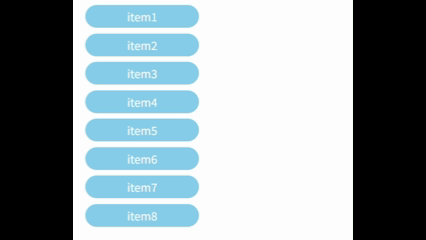
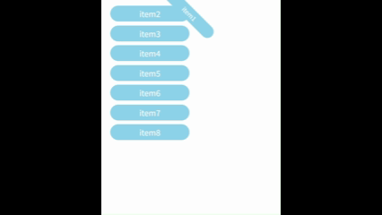

# flip-js

#### 介绍
基于 FLIP 动画思想，处理元素结构变化的动画，并且同时处理元素样式变化引起的动画



动画只要三步：
1. 记录起始状态
2. 自由改变元素结构和样式，移动元素到要去的地方
3. 执行动画

#### 安装教程

```
npm install @fan/flip-js
```

#### 使用说明

1.  引入 flip-js

```js
import { Flip } from '@fan/flip-js';
```

2.  创建 Flip 实例

```js
const flip = new Flip(el[, animateOptionsOrDuration][, otherStyleKeys]);
```

  - 第一个参数 `el` 是必传的，用于指定要动画的元素
  - 第二个参数 `animateOptionsOrDuration` 是可选的，用于指定动画的配置
    - 如果是对象，那么可以指定 `duration`、`easing`、`delay` 等属性
    - 如果是数字，那么会作为 `duration` 属性的值
  - 第三个参数 `otherStyleKeys` 是可选的，用于指定除了 `transform` 以外的其他样式属性，这些属性也会参与动画。

  > 需要注意的是，传入的 key 对应的样式必须支持过渡/动画。例如 display 和背景渐变颜色目前还不支持过渡。背景渐变颜色的实现需要使用最新的 Houdini API 中的 CSS property 才能实现，这就属于另一块知识了。

3.  自由改变元素结构，和各种 CSS 样式

```js
// 改变元素结构
parentEl.appendChild(el);

// 改变元素样式
el.style.width = '200px';
el.style.backgroundColor = 'red';
```

4.  调用实例的 animate 方法，执行动画

```js
flip.animate();
```

除此之外，

#### 示例

这是上面 demo 的代码

```js
import { Flip } from "./flip";

const btn = document.querySelector('button')!;
const ul = document.querySelector('ul')!;
const lis = Array.from(ul.children);
btn.addEventListener('click', function() {

  const flips: Flip[] = [];
  lis.forEach(item => {
    // 1. 先创建 Flip 实例，记录起始状态
    const flip = new Flip(item as HTMLElement, 1000, ['backgroundColor', 'width']);
    flips.push(flip);
  });


  lis.sort(() => Math.random() - 0.5).forEach((item) => {
    // 2. 改变元素结构和样式
    (item as HTMLElement).style.backgroundColor = getRandomColor();
    (item as HTMLElement).style.width = getRandomNumber(100, 300) + 'px';
    ul.appendChild(item);
  });

  flips.forEach(flip => {
    // 3. 调用实例的 animate 方法，执行动画
    flip.animate();
  });
});

function getRandomColor() {
  return '#' + Math.random().toString(16).substring(2, 8);
}

function getRandomNumber(min: number, max: number) {
  return Math.floor(Math.random() * (max - min + 1)) + min;
}
```

也支持同时包含其他复杂 transform 变化（旋转，缩放）的动画，例如：


